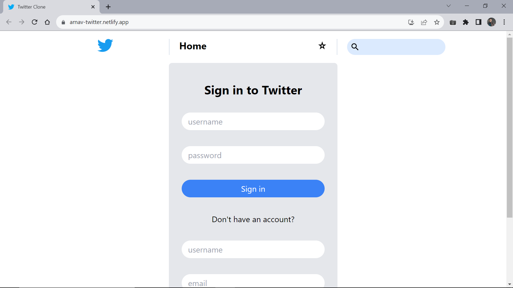
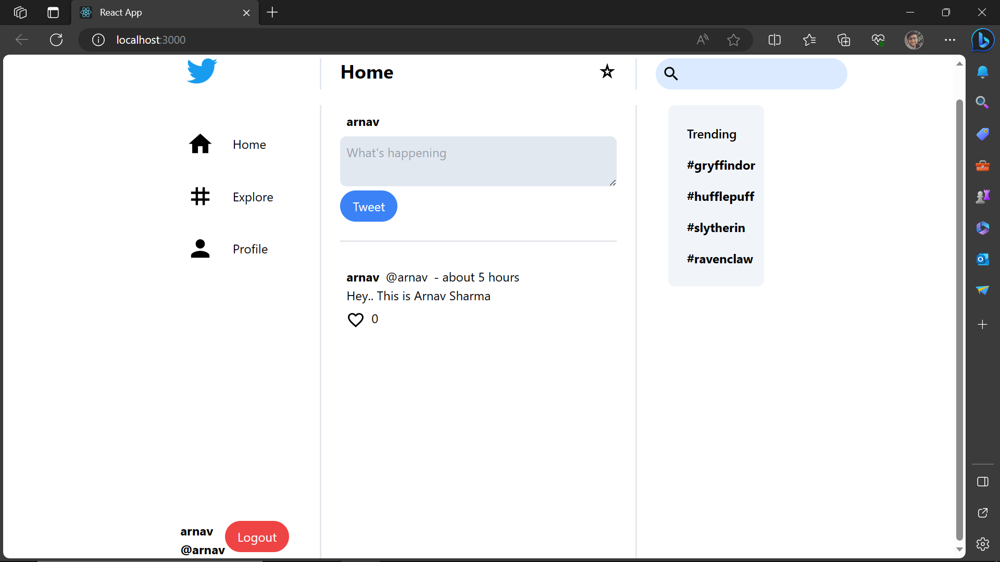
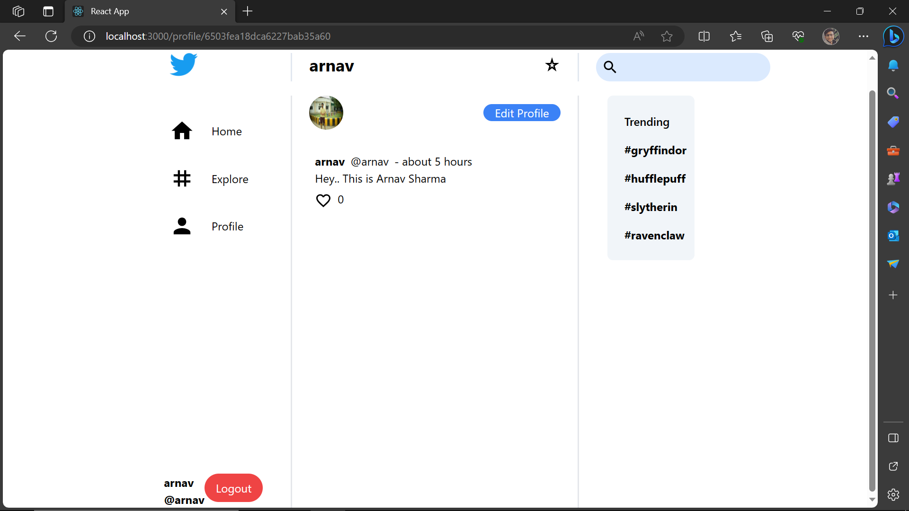
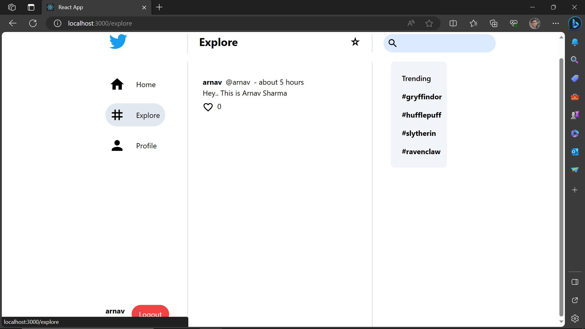

# Twitter Clone App Using MERN  ✔️ [Deployed Link](https://arnav-twitter.netlify.app/)

Twitter clone built using the MERN (MongoDB, Express, React, Node.js) stack. 

## Mandatory

 Install the following softwares and set up on your machine:

- Node.js: Download and install Node.js from https://nodejs.org/.
- MongoDB: Install and configure MongoDB. You can get it from https://www.mongodb.com/.
- Firebase: Set up a Firebase project and obtain your Firebase configuration details. You can do this by visiting https://firebase.google.com/ and following their documentation.

## Begin 

To run the Twitter Clone app locally, follow below given steps:

1. Install server dependencies:  
✔️ cd server 
✔️ npm install

2. Start the server: 
✔️ npm start

3. Open a new terminal window, navigate to the client directory, and install client dependencies: 
✔️ cd ../client 
✔️ npm install

4. Install firebase 
✔️ npm install firebase

5. Create a file named firebase.js in the client/src directory and add the Firebase configuration details. 

6. Start the client: 
✔️ npm start

## Screenshots

✔️ Deployed View / Login Page
 

✔️ Home
 

✔️ Profile
 

✔️ Explore
 

 

 ## 